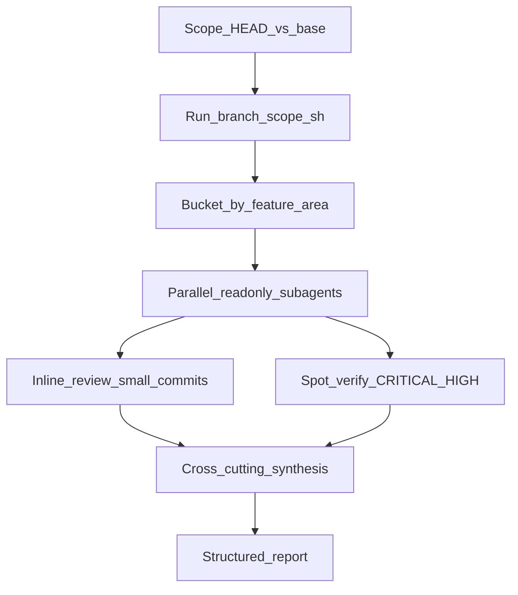

# Branch code review

Thorough, read-only review of **the branch you have checked out** (`HEAD`) compared to a base branch (default **`origin/main`**). Produces a structured report with severities, ratings, and a prioritized fix list.

## Quick start

1. **Read this skill** when the user names `branch-code-review` or asks for a full branch review.

2. **Determine scope** (ask only if ambiguous):

   | Case | Scope |
   |------|--------|
   | Default | All commits: `origin/main..HEAD` on **current checkout** |
   | User names another base | `origin/main..HEAD` → use their base instead |
   | User names another branch | That branch vs base (checkout or `git log base..branch`) |
   | Single commit | `git show <sha>` only; say so in the report |
   | Uncommitted | Also `git diff` / `git diff --cached` when user asks |

   **Edge cases — state explicitly, do not guess:**
   - On `main` with 0 commits ahead of base → no commit scope; offer uncommitted-only or a different base.
   - Uncommitted changes are **not** included unless requested.

3. **Run triage** (read-only):

   ```bash
   bash .agents/skills/branch-code-review/scripts/branch-scope.sh [base-ref]
   ```

   Also note: file count, largest commits, which feature areas appear.

4. **Execute the workflow** below and deliver the report from [reference.md](reference.md).

## Workflow



### Phase A — Triage and split

- Bucket changed files **by feature**, not by commit (one commit may span buckets).
- Review **current file state** in each bucket (later commits may supersede earlier ones).
- Typical buckets in this repo:
  - Co-op supply list / teaching schedule
  - Curriculum PDF + discussion
  - Parent notifications + documentation + charge waive
  - Admin dashboard + tuition payments
  - Feature announcements + enrollment classrooms
  - Bulletin / portal home UI
  - Build/config (Next, Sentry, Turbopack)
  - SQL migrations + `migrations_manual/` mirrors + demo seeds
  - Mobile (`apps/mobile/`) if touched

**When to launch parallel subagents:** a bucket is ~500+ lines or 10+ files. Use the prompt in [reference.md — Subagent prompt template](reference.md#subagent-prompt-template). Subagents are **read-only**.

### Phase B — Direct review

- Small commits (lint, one-line fixes, config-only): read diff inline; no subagent.
- Parent agent **spot-verifies every CRITICAL and HIGH** from subagents against source before reporting.

### Phase C — Cross-cutting synthesis

After per-area findings, roll up recurring patterns (see [reference.md — Patterns to hunt](reference.md#patterns-to-hunt-schoolstack)). Fix-the-pattern-once beats listing the same bug five times.

Common examples on this codebase:

- Org-level enrollment check + `createAdminClient()` + client-supplied `programId`
- Read-modify-write via full-row upsert on Postgres `text[]` columns
- Identity by display name / email fallback on public co-op UIs
- New `*.test.ts` files not added to `package.json` `"test"` list (explicit enumeration — half the repo’s tests may not run in CI)
- RLS `user_is_active_org_member` where staff/guardian scoping was intended
- Preview route missing live parity or calling parent APIs as the logged-in admin

### Phase D — Project rules

Read and apply when the diff touches these areas:

| Rule | Path |
|------|------|
| Family preview parity | [`.cursor/rules/family-preview-parity.mdc`](../../../.cursor/rules/family-preview-parity.mdc) |
| Supabase: manual SQL only | [`.cursor/rules/supabase-manual-sql-only.mdc`](../../../.cursor/rules/supabase-manual-sql-only.mdc) |
| Operational error reporting | [`.cursor/rules/operational-error-reporting.mdc`](../../../.cursor/rules/operational-error-reporting.mdc) |
| SQL file placement | [`.agents/skills/supabase-migrations/SKILL.md`](../supabase-migrations/SKILL.md) |

### Phase E — Constraints

- **Read-only** during review: no edits, commits, migrations applied, or DB writes.
- Do not invent findings; say when code is fine.
- Prioritize by user impact, not formatting.
- Do not nitpick for length; the user asked for substance.

## Report deliverable

Use the template in [reference.md](reference.md). Required sections:

1. **Scope statement** — branch name, base, commit count, files; what was skipped
2. **Cross-cutting patterns** (if any)
3. **Findings** — CRITICAL / HIGH / MEDIUM / LOW with file, why, fix
4. **Things done well**
5. **Worth investigating further**
6. **Executive summary**
7. **Priority fixes** (numbered, ordered)
8. **Overall rating** (1–10): Correctness, Security, Performance, Maintainability, Scalability, Overall
9. **Recommended next steps** (phased)

Match the user’s original review dimensions when they provided a checklist (bugs, security, performance, architecture, code quality, scalability, product logic).

## File routing

See [reference.md — Schoolstack file routing](reference.md#schoolstack-file-routing) for where to look by change type.

## Invocation

```
Read .agents/skills/branch-code-review/SKILL.md and review this branch
```

```
branch-code-review
```

```
branch-code-review — single commit abc1234 only
```

```
branch-code-review vs develop — include uncommitted changes
```

Because `disable-model-invocation: true`, the user must name the skill or path.

## Related skills

- Local E2E after fixes: [`.agents/skills/e2e-local/SKILL.md`](../e2e-local/SKILL.md)
- SQL placement: [`.agents/skills/supabase-migrations/SKILL.md`](../supabase-migrations/SKILL.md)
