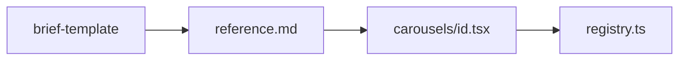

# Marketing carousels

Build or extend LinkedIn carousels in **Marketing Studio** from a structured copy brief. User-facing strings say **MudKitchen** (see `.cursor/rules/mudkitchen-branding.mdc`).

## How to use (human)

1. Copy [brief-template.md](brief-template.md).
2. Fill carousel metadata and each slide (copy verbatim).
3. In chat: **Create this carousel using the marketing-carousels skill.** (attach or paste the filled brief.)

## Agent workflow

1. Read the user brief. If `id`, `fileSlug`, or slides are missing, ask once for gaps.
2. Read [reference.md](reference.md) for slide types and demo window mapping.
3. Validate slide list: `fileName` indices contiguous from `01`; each slide has `slideType` and required copy.
4. Implement `src/components/admin/marketing/carousels/<id>.tsx`:
   - `"use client"`
   - `DEMO_CONTENT_HEIGHT = 920` for product slides unless brief overrides
   - Export `<ID>_CAROUSEL` with `satisfies MarketingCarousel`
   - One component per slide; reuse existing demo windows before building new UI
5. Register in `src/components/admin/marketing/carousels/registry.ts` (append to `MARKETING_CAROUSELS`; do not change `DEFAULT_CAROUSEL_ID` unless brief says so).
6. New surfaces only when brief requires UI not in reference catalog — demo page + `marketing-demo-windows.tsx` wrapper + fixtures; mobile promo per reference.
7. Run `npx tsc --noEmit`.
8. Tell user to verify in Marketing Studio and export PNGs.



## Brief parsing rules

- Treat **title**, **body**, **kicker**, and **ctaLabel** from the brief as final copy unless the user asks for rewrites.
- `product`: map `demoWindow` + `demoProps` to imports from `marketing-demo-windows.tsx`.
- `narrative`: custom `SlideCanvas` layout; follow `tuition-review.tsx` or `HandoffSlide` in `application-finish-line.tsx`.
- `promo`: `CarouselProductSlide` with `variant="promo"`, `demoPresentation="phones"`, `MarketingMobilePromoCluster` `variant` from brief (`tuition` | `admissions`), `promoDensity` from brief.

## Implementation checklist

```
Task progress:
- [ ] Brief parsed; slide count and fileName indices OK
- [ ] Carousel file created with satisfies MarketingCarousel
- [ ] Slides wired to correct type (product / narrative / promo)
- [ ] Demo windows use existing wrappers and fixture ids where applicable
- [ ] registry.ts updated
- [ ] New demo/fixtures/mobile only if brief required them
- [ ] tsc --noEmit passes
- [ ] User reminded: Marketing Studio preview + PNG export
```

## Scope limits

- Do not edit unrelated carousels or marketing UI.
- Do not mutate Supabase for marketing demos; use fixture-driven demo pages.
- Keep diffs focused; match naming and layout of `tuition-review.tsx` and `application-finish-line.tsx`.

## Additional resources

- [brief-template.md](brief-template.md) — empty form + mini example
- [reference.md](reference.md) — demo catalog, promo options, file map
