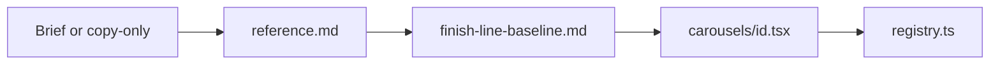

# Marketing carousels

Build or extend LinkedIn carousels in **Marketing Studio** from copy or a structured brief. User-facing strings say **MudKitchen** (see `.cursor/rules/mudkitchen-branding.mdc`).

## How to use (human)

**Path A — Full brief**

1. Copy [brief-template.md](brief-template.md).
2. Fill carousel metadata and each slide (copy verbatim).
3. In chat: **Create this carousel using the marketing-carousels skill.** (attach or paste the filled brief.)

**Path B — Copy only**

Paste numbered slides with kicker / title / body (and optional carousel `id`, `title`, `fileSlug`). Example:

```
Carousel: My topic title
fileSlug: mudkitchen-my-topic

1. Admissions | Application submitted. Who owns the next step? | Give staff and families a clear path…
2. (narrative) Three stages. One connected path. | Families apply. Staff review…
…
7. Promo | From application to enrollment… | Book a demo
```

Then: **Create this carousel using the marketing-carousels skill.**

The agent infers `slideType`, demo windows, and finish-line tone alternation from [finish-line-baseline.md](finish-line-baseline.md) unless you name another reference carousel (e.g. `tuition-review`).

## Agent workflow

1. Read the user input. If `id`, `fileSlug`, or slide copy is missing, ask once for gaps.
2. Read [reference.md](reference.md) for slide types and demo window catalog.
3. **Baseline:** Default layout = [finish-line-baseline.md](finish-line-baseline.md) (paper/forest product slides, optional forest narrative, `l3` spotlight for admissions stories, promo last). Use `tuition-review.tsx` only when the brief is tuition-focused or the user says so.
4. Validate slide list: `fileName` indices contiguous from `01`; each slide has `slideType` and required copy (inferred or explicit).
5. **Promo close:** If using finish-line baseline and the user did not supply a promo slide (and brief does not say “Last slide is promo: no”), append a final promo slide per [finish-line-baseline.md — Promo close slide](finish-line-baseline.md#promo-close-slide-required-default): phones, `trymudkitchen.com`, white **Book a demo** pill (default `ctaLabel`).
6. Implement `src/components/admin/marketing/carousels/<id>.tsx`:
   - `"use client"`
   - `DEMO_CONTENT_HEIGHT = 920` for product slides unless brief overrides
   - Named `CarouselDemoCrop` constants; `tone` alternation on product slides per baseline
   - Export `<ID>_CAROUSEL` with `satisfies MarketingCarousel`
   - One component per slide; reuse existing demo windows before building new UI
7. Register in `src/components/admin/marketing/carousels/registry.ts` (append to `MARKETING_CAROUSELS`; do not change `DEFAULT_CAROUSEL_ID` unless brief says so).
8. New surfaces only when brief requires UI not in reference catalog — demo page + `marketing-demo-windows.tsx` wrapper + fixtures; mobile promo per reference.
9. Run `npx tsc --noEmit`.
10. Tell user to verify in Marketing Studio and export PNGs.



## Brief parsing rules

- Treat **title**, **body**, **kicker**, and **ctaLabel** from the user as final copy unless they ask for rewrites.
- Promo defaults: `promoSiteLabel` = `trymudkitchen.com`, `ctaLabel` = `Book a demo`, `phoneCluster` = `admissions` unless the story is tuition-focused (`tuition`).
- `product`: map `demoWindow` + `demoProps` to imports from `marketing-demo-windows.tsx`; if omitted, use copy → demo table in finish-line-baseline.
- `narrative`: custom `SlideCanvas` layout; forest narrative like `StagesSlide` in `application-finish-line.tsx`, or paper narrative like early `tuition-review.tsx` slides.
- `promo`: `CarouselProductSlide` with `variant="promo"`, `demoPresentation="phones"`, `MarketingMobilePromoCluster` `variant` from brief (`tuition` | `admissions`), `promoDensity` from brief (`compact` for 7+ slides).

## Implementation checklist

```
Task progress:
- [ ] Brief or copy-only input parsed; fileName indices OK
- [ ] finish-line baseline applied (tone alternation, spotlight family if admissions)
- [ ] Carousel file created with satisfies MarketingCarousel
- [ ] Slides wired to correct type (product / narrative / promo)
- [ ] Final promo slide: phones + trymudkitchen.com + Book a demo pill (or brief ctaLabel)
- [ ] Demo windows use existing wrappers and fixture ids where applicable
- [ ] Crop constants defined for product slides; readable in laptop frame
- [ ] registry.ts updated
- [ ] New demo/fixtures/mobile only if brief required them
- [ ] tsc --noEmit passes
- [ ] User reminded: Marketing Studio preview + PNG export
```

## Scope limits

- Do not edit unrelated carousels or marketing UI.
- Do not mutate Supabase for marketing demos; use fixture-driven demo pages.
- Keep diffs focused; match naming and layout of `application-finish-line.tsx` and `tuition-review.tsx`.

## Additional resources

- [brief-template.md](brief-template.md) — structured form + mini example
- [finish-line-baseline.md](finish-line-baseline.md) — default visual rhythm, demo heuristics, 7-slide skeleton
- [reference.md](reference.md) — demo catalog, promo options, file map
