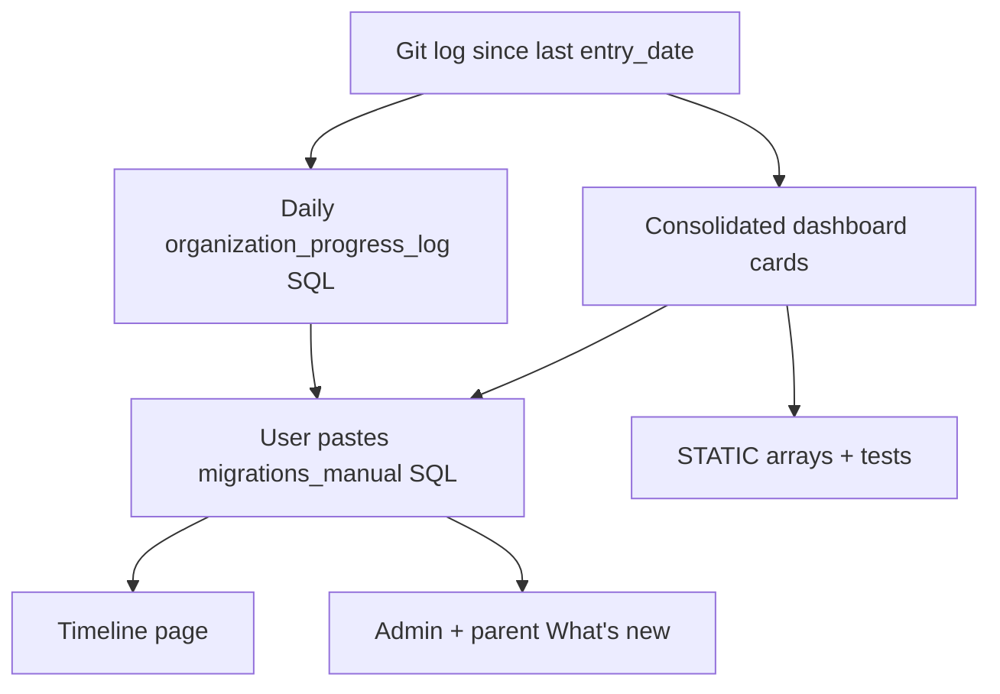

# MudKitchen ship log

End-to-end workflow: review git history since the last timeline entry, write daily Rooted Meadows build logs, add consolidated admin/parent dashboard cards, update static fallbacks and tests, and give the user SQL to paste manually.

Read [reference.md](reference.md) for SQL templates, href maps, and consolidation examples.

## Quick start

1. Read this skill when the user asks for a build log, ship log, or dashboard card catch-up.
2. Run Phase 0–5 below.
3. Never execute SQL against remote Supabase — user pastes into SQL Editor.

## Phase 0 — Find the gap

1. List `supabase/migrations/rooted-meadows/add_organization_progress_log_*.sql` and open the **latest** file. Its `entry_date` is the last published day. Work starts the **next calendar day**.
2. Confirm dual-org slugs (both get the same inserts):
   - `rooted-meadows-school` — public timeline at `/timeline/rooted-meadows-school`
   - `rooted-meadows` — production school admin
3. Find the latest dashboard card migration seeds (`admin_feature_announcements`, `parent_feature_announcements` in `supabase/migrations/`). Cards are **product-wide** (`organization_id IS NULL`), separate from the org-specific build log.
4. Note current phase copy (`phase_number`, `phase_title`) from the most recent progress log file — reuse unless the user says the phase changed.

## Phase 1 — Review shipped work (git)

```bash
# Commits in the gap (adjust start date to day after last entry_date)
git log --since="YYYY-MM-DD" --pretty=format:"%h|%ad|%s" --date=short

# Diff scope (rev before gap start)
git log -1 --before="YYYY-MM-DD" --format=%H
git diff --stat <that-rev>..HEAD
```

**Include:** user-facing admin, parent, teacher, and MudKitchen mobile app changes; schema migrations in `supabase/migrations/` that back new product behavior.

**Exclude:** lint/test-only commits, demo marketing sites (`src/app/demo/`), internal platform-admin tooling.

Group findings **by calendar day** and **feature area** (committees, Friday Branch, messaging, attendance, forms, etc.). Read migrations and feature code when commit messages are vague.

## Phase 2 — Daily build log entries

**Default:** one entry per day (matches existing Sep 2026 pattern). Ask the user only if they prefer fewer themed entries spanning multiple days.

For each day from gap start through today:

1. Create `supabase/migrations/rooted-meadows/add_organization_progress_log_YYYY_MM_DD.sql`
2. Chain `Run after:` to the previous day's file
3. Use plain-language copy for school admins and parents — say **MudKitchen** / **MudKitchen mobile app** (not SchoolStack in user-facing strings)
4. Fields: `title`, `summary` (1–3 sentences), `highlights` (3–5 bullets), `on conflict (organization_id, entry_date) do nothing`

Also:

- Batch file: `supabase/migrations_manual/rooted_meadows_progress_log_<start>_to_<end>.sql` (concatenate daily files)
- Update the table in `supabase/migrations/rooted-meadows/README.md`

**No app code changes** — [`src/app/timeline/rooted-meadows-school/page.tsx`](../../../src/app/timeline/rooted-meadows-school/page.tsx) reads `organization_progress_log` from the database.

SQL placement rules: [`.agents/skills/supabase-migrations/SKILL.md`](../supabase-migrations/SKILL.md) and [`.cursor/rules/supabase-manual-sql-only.mdc`](../../../.cursor/rules/supabase-manual-sql-only.mdc).

## Phase 3 — Dashboard cards (admin + parent)

Two parallel deliverables — **What's new** cards on the school admin dashboard and parent home:

| Portal | Table | Static fallback |
|--------|-------|-----------------|
| Admin | `admin_feature_announcements` | `src/lib/school-admin/admin-feature-announcements.ts` |
| Parent | `parent_feature_announcements` | `src/lib/parent-portal/parent-feature-announcements.ts` |

Cards auto-hide **14 days** after `published_at`. They deep-link via `feature_key` + `href_path`.

### Consolidation rules (required)

Do **not** create one card per commit or per build-log day. Merge related work:

| Rule | Action |
|------|--------|
| Same destination | Same `feature_key` + `href_path` → **one card** with combined description |
| Latest date | Use the **last shipped date** in the range for `published_at` |
| Stable IDs | Keep existing `announcement_id` when updating (e.g. `friday-branch-scheduling`, not three Friday Branch slugs) |
| Skip duplicates | Omit cards for features already covered by cards still inside the 14-day window |
| Fewer, richer | Prefer ~1 card per major feature area over many thin cards |

See [reference.md — Consolidation examples](reference.md#consolidation-examples) (Sep 14–22 canonical).

### Files to create/update

1. `supabase/migrations/<timestamp>_add_admin_feature_announcements_<range>.sql`
2. `supabase/migrations/<timestamp>_add_parent_feature_announcements_<range>.sql`
3. Manual mirrors in `supabase/migrations_manual/`
4. Optional combined batch: `migrations_manual/dashboard_cards_<range>.sql`
5. Append rows to `STATIC_ADMIN_FEATURE_ANNOUNCEMENTS` and `STATIC_PARENT_FEATURE_ANNOUNCEMENTS`
6. Update test counts in:
   - `src/lib/school-admin/admin-feature-announcements.test.ts`
   - `src/lib/parent-portal/parent-feature-announcements.test.ts`

Verify:

```bash
node --import tsx --test src/lib/school-admin/admin-feature-announcements.test.ts src/lib/parent-portal/parent-feature-announcements.test.ts
```

Allowed `feature_key` values and common href paths: [reference.md](reference.md).

Platform admin UI for editing cards: `/admin/organizations` → **Dashboard cards** tab (Admin / Parent sub-tabs).

## Phase 4 — Production cleanup (cards already pasted)

If the user already ran an earlier dashboard-card batch and cards are redundant, add a **consolidate** migration instead of inserting duplicates:

- `supabase/migrations/<timestamp>_consolidate_feature_announcements_<range>.sql`
- Manual: `supabase/migrations_manual/consolidate_dashboard_cards_<range>.sql`

Pattern:

1. `UPDATE` survivor rows (`title`, `description`, `published_at`) where `organization_id IS NULL`
2. `DELETE` redundant global rows by `announcement_id`

Canonical example: [`supabase/migrations/20261024_consolidate_feature_announcements_sep_14_22.sql`](../../../supabase/migrations/20261024_consolidate_feature_announcements_sep_14_22.sql)

Ask the user whether cards are already live before choosing insert-only vs consolidate.

## Phase 5 — User deliverables checklist

Hand off with this checklist (user runs SQL themselves):

- [ ] Paste `migrations_manual/rooted_meadows_progress_log_<start>_to_<end>.sql` in Supabase SQL Editor
- [ ] Paste dashboard cards batch **or** consolidate script (if cards were already live)
- [ ] Optionally run `migrations_manual/sync_rooted_meadows_progress_log_to_production.sql` to copy timeline entries to production org
- [ ] Verify `/timeline/rooted-meadows-school` (newest entries first; page revalidates every 5 minutes)
- [ ] Verify platform admin → Schools → Dashboard cards → Product defaults (Admin + Parent tabs)
- [ ] Spot-check a school admin dashboard and parent home — no duplicate cards for the same feature link

## Architecture



## Related skills and rules

- SQL folder rules: [`.agents/skills/supabase-migrations/SKILL.md`](../supabase-migrations/SKILL.md)
- Manual SQL only: [`.cursor/rules/supabase-manual-sql-only.mdc`](../../../.cursor/rules/supabase-manual-sql-only.mdc)
- MudKitchen branding: [`.cursor/rules/mudkitchen-branding.mdc`](../../../.cursor/rules/mudkitchen-branding.mdc)
- Progress log README: [`supabase/migrations/rooted-meadows/README.md`](../../../supabase/migrations/rooted-meadows/README.md)
