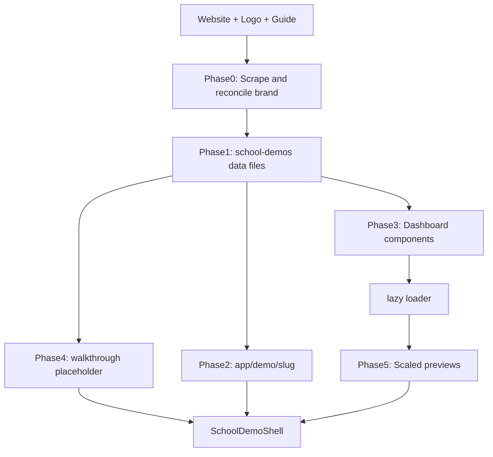

# School Demo Builder

Repeatable workflow for adding a new school demo at `/demo/{slug}`. Canonical reference: **Luff Learning** (`src/app/demo/luff-learning/`).

## Required inputs

Ask the user if any are missing:

| Input | Example |
|---|---|
| School name | Luff Learning Fine Arts Academy |
| Website URL | https://lufflearning.org/ |
| Logo path | `public/images/demo/lufflearning/Logo....png` |
| Redesign guide | `guides/demos/luff_learning_redesign_guide.md` |
| URL slug (optional) | `luff-learning` — derive kebab-case from name if omitted |

If no redesign guide exists, copy [redesign-guide-template.md](redesign-guide-template.md) to `guides/demos/{school}_redesign_guide.md`, scrape the site to fill it, then proceed.

## Architecture



## Phase 0 — Research (before coding)

1. Read the redesign guide — copy themes, programs, testimonials, FAQ, contact info.
2. Scrape the live site — homepage, programs, FAQ, events, stories; supplement guide gaps.
3. Reconcile brand colors — cross-check guide hex values against logo + live CSS. WP/Kadence scrapes often mislabel roles (e.g. `#efad1f` labeled "purple" but is gold). Pick corrected palette: primary CTA, hover, heading accent, text, soft bg. See [reference.md](reference.md#color-reconciliation).
4. Logo handling — reverse/dark logos go on dark nav/hero bands; set width/height in config.
5. Pick fonts from guide/site (Google Fonts in layout).

## Phase 1 — Data layer

Create in `src/data/school-demos/`:

| File | Exports |
|---|---|
| `{slug}.ts` | `{camelCase}Config: SchoolWebsiteDemoConfig` |
| `{slug}-admin-demo.ts` | `*_LOGO`, `*_ADMIN_COLORS`, `*_ADMIN_COMPACT_ROWS` |
| `{slug}-parent-demo.ts` | Re-export logo/colors + parent accent/name constants |
| `{slug}-teacher-demo.ts` | `*_TEACHER_PROGRAM_LABELS`, `*_TEACHER_PROGRAM_ORDER` |

Model `{slug}.ts` on `lighthouse-homeschool.ts` or `luff-learning.ts`. Register in `index.ts` (named export + registry key).

Website config must include: `theme`, `hero`, `signatureSection`, `stats`, `welcome`, `marquee`, `programs` (3–4 cards), `socialProof` (testimonials), `founder`, `form`, `faq`, `closingCta`, `footer`.

Testimonials must use `DemoTestimonial` shape — see [reference.md](reference.md#testimonial-shape).

## Phase 2 — App route

```
src/app/demo/{slug}/
  page.tsx   → SchoolDemoShell + config + walkthrough placeholder
  layout.tsx → Google Fonts + pageMetadata (noIndex: true)
```

Copy from `src/app/demo/luff-learning/`.

## Phase 3 — Dashboard components

Create `src/components/demo/{folder}/`:

| File | Pattern |
|---|---|
| `{Brand}WebsiteDashboardDemo.tsx` | Thin wrapper → `WebsiteDashboardDemo` + config |
| `{Brand}AdminDashboardDemo.tsx` | Fork latest admin demo (~24k lines) |
| `{Brand}ParentDashboardDemo.tsx` | Fork parent demo |
| `{Brand}TeacherDashboardDemo.tsx` | Fork teacher demo |
| `lazy{Brand}Demos.tsx` | Cached `dynamic()` imports + prefetch helpers |

**Fork source:** copy from `lighthousehomeschool/` or `lufflearning/` (whichever is newest), then bulk-replace:

- Component names, import paths, `*_ADMIN_*` / `*_PARENT_*` / `*_TEACHER_*` constants
- School name, location, email, phone
- Teacher program IDs to match `{slug}-teacher-demo.ts`
- High-visibility mock data only (leads, subtitle, tuition labels, calendar events)

Do **not** rewrite admin dashboard UI from scratch.

### Bulk-replace commands (example)

After copying Lighthouse → Luff files:

```bash
# Copy
cp src/components/demo/lighthousehomeschool/LighthouseHomeschoolAdminDashboardDemo.tsx \
   src/components/demo/{folder}/{Brand}AdminDashboardDemo.tsx
# Repeat for parent, teacher

# Replace (adjust names per school)
sed -i '' \
  -e 's/LighthouseHomeschool/{Brand}/g' \
  -e 's/lighthouse-admin-demo/{slug}-admin-demo/g' \
  -e 's/LIGHTHOUSE_/{PREFIX}_/g' \
  -e 's/Lighthouse Homeschool Academy/{School Name}/g' \
  src/components/demo/{folder}/{Brand}*.tsx
```

Naming conventions: [reference.md](reference.md#naming-conventions).

## Phase 4 — Walkthrough

Append `{camelCase}WalkthroughPlaceholder` (9 steps) to `src/data/school-demos/walkthrough-placeholder.ts`:

1. discover (website)
2. inquire (form)
3. view-lead (admin)
4. send-application-link (admin)
5. parent-enrollment (parent)
6. parent-pays-tuition (parent)
7. teacher-attendance (teacher)
8. mobile-app (mobile)
9. get-in-touch (contact)

Use `createMobileAppWalkthroughStep(theme)` for step 8 (before contact). Theme steps with school primary + accent colors. Copy structure from `luffLearningWalkthroughPlaceholder`.

## Phase 5 — Scaled preview wiring (required)

Add slug branch **before Athena fallback** in all four:

- `src/components/demo/ScaledWebsiteDemoPreview.tsx`
- `src/components/demo/ScaledAdminDemoPreview.tsx`
- `src/components/demo/ScaledParentDemoPreview.tsx`
- `src/components/demo/ScaledTeacherDemoPreview.tsx`

Each needs: import from `lazy*Demos`, `is{Slug}` check, prefetch in `useEffect`, component in ternary chain (first branch).

## Phase 5b — Mobile showcase (required)

1. Create `src/components/demo/{folder}/{Brand}MobileAppShowcase.tsx` using shared `SchoolMobileAppShowcase` + `createMicroschoolMobileSlides` from `src/components/demo/mobile/`.
2. Pass school `ADMIN_COLORS.accent`, founder/guide name for messages, and optional `schoolName` for the admissions slide header.
3. Register slug in `MOBILE_SHOWCASE_LOADERS` inside `src/components/demo/ScaledMobileAppPreview.tsx`.

### Mobile slide requirements (5 tabs)

Microschool demos use **Parent · Admin · Teacher** tabs (not committees):

| Tab | Audience | Must include |
|---|---|---|
| Messages | Parent | Thread UI with teacher name, online indicator, unread badge |
| Tuition | Parent | Gradient balance card, child filter pills, invoice list, per-row Pay + Pay All, paid state |
| Admissions | Admin | Submission cards, flow/status filters, tags, tap-to-detail sheet with Send application link CTA |
| Attendance | Teacher | 8–10 students, day navigator, search, Present / Pickup / Absent action buttons per row |
| Students | Teacher | Full roster with avatars, status pills, guardian contact, expandable profile chips |

Shared data lives in `src/components/demo/mobile/mobileDemoData.ts`. Slide components live under `src/components/demo/mobile/slides/`.

## Phase 6 — Verify

- [ ] `npm run build` — route appears as `/demo/{slug}`
- [ ] Walkthrough loads all 4 previews with correct branding
- [ ] Walkthrough step 8 loads mobile preview with school accent + hint tooltip
- [ ] Teacher program tabs match `{slug}-teacher-demo.ts` labels
- [ ] Testimonials render (correct shape, not trust-item shape)
- [ ] Logo readable on nav/hero background

## Usage example

User prompt:

> Build a demo for {School Name}. Website: {url}. Logo: {path}. Guide: {guides/demos/...md}

Follow phases 0–6. Mark todos if present. Run build before finishing.

## Out of scope

- Committing or opening PRs (unless user asks)
- Editing plan files
- Rewriting admin dashboard UI from scratch

## Additional resources

- [reference.md](reference.md) — naming table, file checklist, palette rules
- [redesign-guide-template.md](redesign-guide-template.md) — starter guide when none exists
