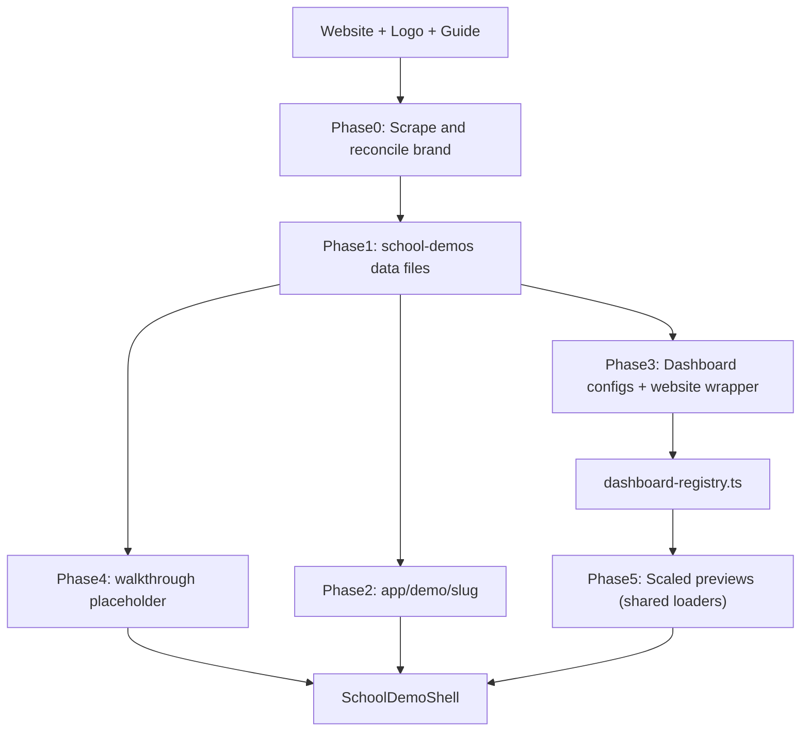

# School Demo Builder

Repeatable workflow for adding a new school demo at `/demo/{slug}`. Canonical reference: **Luff Learning** (`src/app/demo/luff-learning/`).

## Required inputs

Ask the user if any are missing:

| Input | Example |
|---|---|
| School name | Luff Learning Fine Arts Academy |
| Website URL | https://lufflearning.org/ |
| Logo path | `public/images/demo/lufflearning/Logo....png` |
| Redesign guide | `guides/demos/luff_learning_redesign_guide.md` |
| URL slug (optional) | `luff-learning` — derive kebab-case from name if omitted |

If no redesign guide exists, copy [redesign-guide-template.md](redesign-guide-template.md) to `guides/demos/{school}_redesign_guide.md`, scrape the site to fill it, then proceed.

## Architecture



## Phase 0 — Research (before coding)

1. Read the redesign guide — copy themes, programs, testimonials, FAQ, contact info.
2. Scrape the live site — homepage, programs, FAQ, events, stories; supplement guide gaps.
3. Reconcile brand colors — cross-check guide hex values against logo + live CSS. WP/Kadence scrapes often mislabel roles (e.g. `#efad1f` labeled "purple" but is gold). Pick corrected palette: primary CTA, hover, heading accent, text, soft bg. See [reference.md](reference.md#color-reconciliation).
4. Logo handling — reverse/dark logos go on dark nav/hero bands; set width/height in config.
5. Pick fonts from guide/site (Google Fonts in layout).

## Phase 1 — Data layer

Create in `src/data/school-demos/`:

| File | Exports |
|---|---|
| `{slug}.ts` | `{camelCase}Config: SchoolWebsiteDemoConfig` |
| `{slug}-admin-demo.ts` | `*_LOGO`, `*_ADMIN_COLORS`, `*_ADMIN_COMPACT_ROWS`, `{camelCase}AdminDemoConfig` |
| `{slug}-parent-demo.ts` | Logo/colors constants + `{camelCase}ParentDemoConfig` |
| `{slug}-teacher-demo.ts` | `*_TEACHER_PROGRAM_LABELS`, `*_TEACHER_PROGRAM_ORDER`, `{camelCase}TeacherDemoConfig` |

Model `{slug}.ts` on `lighthouse-homeschool.ts` or `luff-learning.ts`. Register in `index.ts` (named export + registry key).

Export `*DemoConfig` objects typed from `demo-dashboard-types.ts` (see `luff-learning-admin-demo.ts`). Then register each config in `dashboard-registry.ts` under `schoolAdminDemoConfigs`, `schoolParentDemoConfigs`, and `schoolTeacherDemoConfigs`.

Website config must include: `theme`, `hero`, `signatureSection`, `stats`, `welcome`, `marquee`, `programs` (3–4 cards), `socialProof` (testimonials), `founder`, `form`, `faq`, `closingCta`, `footer`.

Testimonials must use `DemoTestimonial` shape — see [reference.md](reference.md#testimonial-shape).

## Phase 2 — App route

```
src/app/demo/{slug}/
  page.tsx   → SchoolDemoShell + config + walkthrough placeholder
  layout.tsx → Google Fonts + pageMetadata (noIndex: true)
```

Copy from `src/app/demo/luff-learning/`.

## Phase 3 — Dashboard data (no TSX forks)

Shared portal UI: `src/components/demo/shared/School*DashboardDemo.tsx`.

Per school, export `*DemoConfig` from `{slug}-admin-demo.ts`, `{slug}-parent-demo.ts`, and `{slug}-teacher-demo.ts`, then register in `dashboard-registry.ts`.

**Optional admin mock overrides:** If leads, events, or emails should differ from the canonical Luff demo, add `src/data/school-demos/admin-content/{slug}.ts` and reference it from `SchoolAdminDemoConfig.contentOverrides` (see `lighthouse-homeschool` admin config). Do not edit the shared admin component for school-specific copy.

Component folder still needs `{Brand}WebsiteDashboardDemo.tsx` and `{Brand}MobileAppShowcase.tsx` only.

**Do not** fork admin/parent/teacher dashboard TSX — per-school forks caused Vercel build OOM. Shared components implement the **School Day Story** look (see Phase 3b).

Naming conventions: [reference.md](reference.md#naming-conventions).

## Phase 3b — Story alignment (portal previews)

All config-driven portal demos share the School Day Story system used in live MudKitchen portals:

- Theme bridge: `src/components/demo/shared/demo-story-theme.ts` — `buildDemoParentThemeTokens()` from admin/parent/teacher accent colors
- Runtime exports: `ADMIN_DEMO_STORY_THEME`, `PARENT_DEMO_STORY_THEME`, `TEACHER_DEMO_STORY_THEME` (set in `*-demo-runtime.ts` on `apply*DemoRuntime`)
- Portal previews use **Fraunces + DM Sans** (`fraunces`, `dmSans` from `@/lib/fonts`) and paper canvas `#F8F8F3` / admin `#F7F9F7`
- Website walkthrough step keeps **school-specific fonts** from `src/app/demo/{slug}/layout.tsx`

When adding a school, ensure `{slug}-admin-demo.ts` `colors.accent` matches `{slug}-parent-demo.ts` and `{slug}-teacher-demo.ts` accent values so story tokens stay consistent across previews.

Do **not** import live portal route components from `src/app/school/` — only reuse story UI primitives from `src/components/school-admin/ui/story/` or `src/components/school-parent/ui/` when needed (read-only).

**Admin admissions submissions preview** must match the live school admin submissions list via `DemoApplicationSubmissionsTab` (`src/components/demo/shared/DemoApplicationSubmissionsTab.tsx`) and the detail drawer via `DemoApplicationSubmissionDetailPanel` — not the live Supabase-backed `ApplicationSubmissionDetailPanel`. Map demo leads through `demo-submissions-mapper.ts`.

## Phase 3c — Website story alignment (walkthrough step 1)

The scaled website preview in `/demo/{slug}` uses the shared School Day Story landing system:

- Theme bridge: `buildDemoWebsiteThemeVars()` and `demoWebsiteShellStyle()` in `src/components/demo/shared/demo-story-theme.ts` — merged in `WebsiteDashboardDemo` `getThemeVars()`
- Shared primitives under `src/components/sections/website-demo/`: `DemoWebsiteSectionKicker`, `DemoWebsiteCard`, `DemoWebsiteButton`, `DemoWebsiteStoryHero`
- Hero: paper split layout via `DemoWebsiteStoryHero` (no full-viewport dark overlay)
- **Keep school-specific fonts** in `src/app/demo/{slug}/layout.tsx` (`font-heading` / `font-secondary`) — do not swap website step to Fraunces/DM Sans
- Form section must stay `id="form"` with `scroll-mt-[72px]` for walkthrough step 2 (`inquire`)
- `DemoPreviewFrame` website variant outer bg: `#F8F8F3`
- Signature sections (`website-demo/*Section.tsx`) consume the same story primitives and CSS vars — no per-school website TSX forks

## Phase 4 — Walkthrough

Append `{camelCase}WalkthroughPlaceholder` (9 steps) to `src/data/school-demos/walkthrough-placeholder.ts`:

1. discover (website)
2. inquire (form)
3. view-lead (admin)
4. send-application-link (admin)
5. parent-enrollment (parent)
6. parent-pays-tuition (parent)
7. teacher-attendance (teacher)
8. mobile-app (mobile)
9. get-in-touch (contact)

Use `createMobileAppWalkthroughStep(theme)` for step 8 (before contact). Theme steps with school primary + accent colors. Copy structure from `luffLearningWalkthroughPlaceholder`.

## Phase 5 — Scaled preview wiring (required)

Register the school slug in:

- `src/data/school-demos/dashboard-registry.ts` — import and add to all three maps: `schoolAdminDemoConfigs`, `schoolParentDemoConfigs`, `schoolTeacherDemoConfigs`
- `src/components/demo/shared/lazySchoolWebsiteDemo.tsx` (`WEBSITE_DEMO_LOADERS` — if new website wrapper path)
- `src/components/demo/ScaledMobileAppPreview.tsx` (`MOBILE_SHOWCASE_LOADERS`)

Admin/parent/teacher `Scaled*` previews need **no per-school edits** once configs are in the registry — shared loaders resolve by `demoSlug`. **Rooted Meadows** is the only standard demo with custom dashboard forks (`src/components/demo/rootedmeadows/`). Sagefield is a separate customer demo — out of scope here.

## Phase 5b — Mobile showcase (required)

1. Create `src/components/demo/{folder}/{Brand}MobileAppShowcase.tsx` using shared `SchoolMobileAppShowcase` + `createMicroschoolMobileSlides` from `src/components/demo/mobile/`.
2. Pass school `ADMIN_COLORS.accent`, founder/guide name for messages, and optional `schoolName` for the admissions slide header.
3. Register slug in `MOBILE_SHOWCASE_LOADERS` inside `src/components/demo/ScaledMobileAppPreview.tsx`.

### Mobile slide requirements (5 tabs)

Microschool demos use **Parent · Admin · Teacher** tabs (not committees):

| Tab | Audience | Must include |
|---|---|---|
| Messages | Parent | Thread UI with teacher name, online indicator, unread badge |
| Tuition | Parent | Gradient balance card, child filter pills, invoice list, per-row Pay + Pay All, paid state |
| Admissions | Admin | Submission cards, flow/status filters, tags, tap-to-detail sheet with Send application link CTA |
| Attendance | Teacher | 8–10 students, day navigator, search, Present / Pickup / Absent action buttons per row |
| Students | Teacher | Full roster with avatars, status pills, guardian contact, expandable profile chips |

Shared data lives in `src/components/demo/mobile/mobileDemoData.ts`. Slide components live under `src/components/demo/mobile/slides/`.

## Phase 6 — Verify

- [ ] `npm run build` — route appears as `/demo/{slug}`
- [ ] Walkthrough loads all 4 previews with correct branding
- [ ] Walkthrough step 8 loads mobile preview with school accent + hint tooltip
- [ ] Teacher program tabs match `{slug}-teacher-demo.ts` labels
- [ ] Testimonials render (correct shape, not trust-item shape)
- [ ] Logo readable on nav/hero background
- [ ] Admin submissions preview uses story metric strip, sage attention banner, paper table card (not flat gray sidebar + solid blue pills)
- [ ] Admin submissions list/detail use `DemoApplicationSubmissionsTab` + `DemoApplicationSubmissionDetailPanel` with live-portal columns, filters, and metrics
- [ ] Parent/teacher previews use paper canvas, Fraunces headings, brand accent via CSS vars (no hardcoded `#336699`)
- [ ] Mobile slides use paper phone interior (`#F8F8F3`) and rounded story tab pills

## Usage example

User prompt:

> Build a demo for {School Name}. Website: {url}. Logo: {path}. Guide: {guides/demos/...md}

Follow phases 0–6. Mark todos if present. Run build before finishing.

## Out of scope

- Committing or opening PRs (unless user asks)
- Editing plan files
- Rewriting admin dashboard UI from scratch

## Additional resources

- [reference.md](reference.md) — naming table, file checklist, palette rules
- [redesign-guide-template.md](redesign-guide-template.md) — starter guide when none exists
