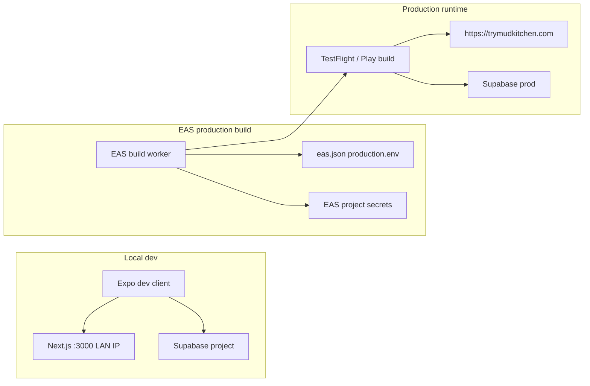

# Mobile EAS production deploy

Release the MudKitchen mobile app via **Expo Application Services (EAS)**. The app calls **production Next.js** at `EXPO_PUBLIC_SITE_URL` for school-admin APIs and **Supabase** for auth. Public env vars are baked in at build time.

Local Maestro testing is separate — see [mobile E2E skill](../../.agents/skills/mobile-e2e-local/SKILL.md).

## How it works



## Safety rules (follow first)

1. **Do not edit `.env` for a release** — that file is for day-to-day dev (LAN IP + remote Supabase). Production values come from **`eas.json`** + **EAS secrets**.
2. **Never use `.env.e2e.local` for production builds** — E2E only (local Supabase + port 3100).
3. **Do not put Supabase keys in `eas.json`** — use `eas secret:create` (or `eas env:create`) on the Expo project.
4. **Deploy web before mobile** when the release depends on new API routes or server logic — production mobile hits `https://trymudkitchen.com`.
5. **Run assert before cloud build** — `scripts/assert-production-mobile-env.sh` blocks localhost, `192.168.x.x`, and dev ports (`:3000`, `:3100`). Production npm scripts set `EXPO_PUBLIC_SITE_URL` for this check automatically.

## Env matrix

| Context | `EXPO_PUBLIC_SITE_URL` | Supabase | Source |
|---------|------------------------|----------|--------|
| Day-to-day dev | Mac LAN IP `:3000` | Same project as web | `.env` |
| Maestro E2E | `127.0.0.1` / `10.0.2.2` `:3100` | Local Supabase | `.env.e2e.local` |
| EAS production | `https://trymudkitchen.com` | Production Supabase | [`eas.json`](eas.json) `production.env` + EAS secrets |

Documented production values (reference only — not loaded during EAS build): [`.env.production.example`](.env.production.example).

## Prerequisites

- [EAS CLI](https://docs.expo.dev/build/setup/): `npm i -g eas-cli`
- Expo account: `eas login`
- Apple Developer + App Store Connect (iOS / TestFlight)
- Google Play Console (Android)
- Production Supabase URL and publishable key (same as web production)
- Vercel production live at `https://trymudkitchen.com`

## One-time setup

### 1. Link Expo project

```bash
cd apps/mobile
eas login
eas build --profile production --platform ios   # first run prompts to create/link project
```

Accept linking; Expo may add `extra.eas.projectId` to app config.

### 2. EAS secrets (Supabase)

Set once per Expo project (values from production Supabase / Vercel env):

```bash
cd apps/mobile
eas secret:create --name EXPO_PUBLIC_SUPABASE_URL --value "https://<project-ref>.supabase.co"
eas secret:create --name EXPO_PUBLIC_SUPABASE_PUBLISHABLE_KEY --value "<publishable-key>"
```

EAS injects these into production builds together with profile env from [`eas.json`](eas.json).

### 3. Store credentials

- **iOS:** `eas credentials` — EAS can manage distribution cert + provisioning, or upload your own. App Store Connect app for bundle ID `com.mudkitchen.schoolstack.mobile` ([`app.json`](app.json)).
- **Android:** EAS default signing is typical for first releases; configure in `eas credentials` if needed. Package `com.mudkitchen.schoolstack.mobile`.

## Release checklist

Before each store release:

1. Merge to `main` and confirm **Vercel production** is deployed with any API changes the app needs.
2. Quality gates (repo root):
   ```bash
   npm run mobile:lint
   npm run mobile:typecheck
   npm run mobile:test
   ```
3. Bump version when shipping a user-visible release:
   - [`app.json`](app.json) — `expo.version`
   - iOS build number / Android `versionCode` (via `eas.json` `autoIncrement` or manual `app.json` / `eas build` prompts)
4. Production build (see below).
5. Submit to TestFlight / Play (see below).

## Production build

[`eas.json`](eas.json) profiles:

| Profile | Use |
|---------|-----|
| `development` | Dev client, internal distribution |
| `production` | Store builds; sets `EXPO_PUBLIC_SITE_URL=https://trymudkitchen.com` on EAS workers |

From `apps/mobile`:

```bash
npm run build:production:ios
# or
npm run build:production:android
```

Scripts run [`scripts/assert-production-mobile-env.sh`](scripts/assert-production-mobile-env.sh) with production `EXPO_PUBLIC_SITE_URL`, then `eas build --profile production`.

Monitor: [expo.dev](https://expo.dev) → project → Builds.

## Submit to stores

After a successful production build:

```bash
cd apps/mobile
eas submit --platform ios      # TestFlight / App Store Connect
eas submit --platform android  # Google Play
```

First submit may prompt for Apple App Store Connect API key or Google service account. Optional later: add `submit.production` in `eas.json` to pin ASC app ID / Play track.

**CI note:** [`.github/workflows/mobile.yml`](../../.github/workflows/mobile.yml) runs lint, typecheck, Jest, and Maestro E2E — **no EAS builds**. Releases are manual via EAS CLI today (future: GitHub Actions + `EXPO_TOKEN`).

## Troubleshooting

| Symptom | Fix |
|---------|-----|
| `EXPO_PUBLIC_SITE_URL is not set` (assert) | Use `npm run build:production:*` (sets URL in script) — do not rely on `.env` alone |
| Assert blocks localhost / `:3000` | Expected if `.env` leaked into shell; unset or use npm scripts |
| Build succeeds but app can't reach API | Confirm Vercel prod deployed; verify `EXPO_PUBLIC_SITE_URL` in build logs |
| Auth fails in production build | Re-check EAS secrets match **production** Supabase, not local |
| Missing Supabase env in build | Run `eas secret:list`; recreate `EXPO_PUBLIC_SUPABASE_*` secrets |
| `eas build` asks to configure project | Run from `apps/mobile`; complete `eas build:configure` / link flow |
| API 404 on new feature | Web not deployed yet — ship Next.js production first |

## References

- Dev setup: [README.md](README.md)
- EAS config: [eas.json](eas.json)
- Local E2E: [mobile-e2e-local skill](../../.agents/skills/mobile-e2e-local/SKILL.md)
- Agent skill (same runbook): [mobile-eas-deploy skill](../../.agents/skills/mobile-eas-deploy/SKILL.md)
- CI: [mobile workflow](../../.github/workflows/mobile.yml)

## Out of scope (future)

- GitHub Actions `eas build` on merge to `main` (`EXPO_TOKEN`, Apple API key in repo secrets)
- `eas update` / OTA for JS-only hotfixes
- Staging EAS profile (e.g. Vercel preview URL)
