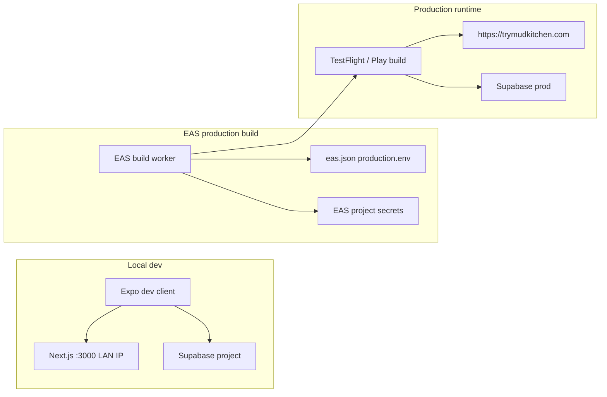

# Mobile EAS production deploy

Release the MudKitchen mobile app via **Expo Application Services (EAS)**. The app calls **production Next.js** at `EXPO_PUBLIC_SITE_URL` for school-admin APIs and **Supabase** for auth. Public env vars are baked in at build time.

Local Maestro testing is separate — see [mobile E2E skill](../../.agents/skills/mobile-e2e-local/SKILL.md).

## How it works



## Safety rules (follow first)

1. **Do not edit `.env` for a release** — that file is for day-to-day dev (LAN IP + remote Supabase). Production values come from **`eas.json`** + **EAS secrets**.
2. **Never use `.env.e2e.local` for production builds** — E2E only (local Supabase + port 3100).
3. **Do not put Supabase keys in `eas.json`** — use `eas secret:create` (or `eas env:create`) on the Expo project.
4. **Deploy web before mobile** when the release depends on new API routes or server logic — production mobile hits `https://trymudkitchen.com`.
5. **Run assert before cloud build** — `scripts/assert-production-mobile-env.sh` blocks localhost, `192.168.x.x`, dev ports (`:3000`, `:3100`), and URLs whose `/api/health` redirects (redirects strip the auth header). Production npm scripts set `EXPO_PUBLIC_SITE_URL` for this check automatically.

## Env matrix

| Context | `EXPO_PUBLIC_SITE_URL` | Supabase | Source |
|---------|------------------------|----------|--------|
| Day-to-day dev | Mac LAN IP `:3000` | Same project as web | `.env` |
| Maestro E2E | `127.0.0.1` / `10.0.2.2` `:3100` | Local Supabase | `.env.e2e.local` |
| EAS production | `https://trymudkitchen.com` | Production Supabase | [`eas.json`](eas.json) `production.env` + EAS secrets |

Documented production values (reference only — not loaded during EAS build): [`.env.production.example`](.env.production.example).

## Prerequisites

- [EAS CLI](https://docs.expo.dev/build/setup/): `npm i -g eas-cli`
- Expo account: `eas login`
- Apple Developer + App Store Connect (iOS / TestFlight)
- Google Play Console (Android)
- Production Supabase URL and publishable key (same as web production)
- Vercel production live at `https://trymudkitchen.com`

## One-time setup

### 1. Link Expo project

```bash
cd apps/mobile
eas login
eas build --profile production --platform ios   # first run prompts to create/link project
```

Accept linking; Expo may add `extra.eas.projectId` to app config.

### 2. EAS secrets (Supabase)

Set once per Expo project (values from production Supabase / Vercel env):

```bash
cd apps/mobile
eas secret:create --name EXPO_PUBLIC_SUPABASE_URL --value "https://<project-ref>.supabase.co"
eas secret:create --name EXPO_PUBLIC_SUPABASE_PUBLISHABLE_KEY --value "<publishable-key>"
```

EAS injects these into production builds together with profile env from [`eas.json`](eas.json).

### 3. Store credentials

- **iOS:** `eas credentials` — EAS can manage distribution cert + provisioning, or upload your own. App Store Connect app for bundle ID `com.mudkitchen.schoolstack.mobile` ([`app.json`](app.json)).
- **Android:** EAS default signing is typical for first releases; configure in `eas credentials` if needed. Package `com.mudkitchen.schoolstack.mobile`.

### 4. Push notification credentials (required for notifications to arrive)

Store signing credentials and push delivery credentials are separate. The app will not crash without push credentials, but notifications stay silent until these are uploaded.

**iOS — APNs key (.p8)**

1. Apple Developer → Certificates, Identifiers & Profiles → Keys → create key with **Apple Push Notifications service (APNs)**
2. Download the `.p8` file (one-time download; note Key ID and Team ID)
3. Upload via Expo:
   ```bash
   cd apps/mobile
   eas credentials -p ios
   ```
   Navigate: **Push Notifications → Upload an APNs Key**

**Android — FCM v1 service account**

1. Firebase Console → your Android app (`com.mudkitchen.schoolstack.mobile`) → Project settings
2. Ensure **Firebase Cloud Messaging API** is enabled (Google Cloud Console)
3. Create a service account with **Firebase Cloud Messaging Admin** role; download JSON key
4. Upload via Expo:
   ```bash
   cd apps/mobile
   eas credentials -p android
   ```
   Navigate: **Google Service Account → Manage your Google Service Account Key for Push Notifications (FCM V1) → Upload a new service account key**

You can also upload both from [expo.dev](https://expo.dev) → project → Credentials.

**Optional — server Expo access token**

Add `EXPO_ACCESS_TOKEN` to Vercel production env (create at expo.dev → Access Tokens). Improves reliability for the Expo Push API sender in `src/lib/messages/expo-push.ts`.

## Release checklist

Before each store release:

1. Merge to `main` and confirm **Vercel production** is deployed with any API changes the app needs.
2. Quality gates (repo root):
   ```bash
   npm run mobile:lint
   npm run mobile:typecheck
   npm run mobile:test
   ```
3. Bump version when shipping a user-visible release:
   - [`app.json`](app.json) — `expo.version` (user-facing, e.g. `1.0.0`)
   - iOS build number / Android `versionCode` — **auto-incremented** on production builds via [`eas.json`](eas.json) (`cli.appVersionSource: remote`, `production.autoIncrement: true`). Do not bump these manually unless syncing an existing store app (`eas build:version:set`).
4. Production build (see below).
5. Submit to TestFlight / Play (see below).

## Production build

[`eas.json`](eas.json) profiles:

| Profile | Channel | Use |
|---------|---------|-----|
| `development` | `development` | Dev client, internal distribution |
| `production` | `production` | Store / TestFlight builds; sets `EXPO_PUBLIC_SITE_URL=https://trymudkitchen.com` on EAS workers |

From `apps/mobile`:

```bash
npm run build:production:ios
# or
npm run build:production:android
```

Scripts run [`scripts/assert-production-mobile-env.sh`](scripts/assert-production-mobile-env.sh) with production `EXPO_PUBLIC_SITE_URL`, then `eas build --profile production`.

Monitor: [expo.dev](https://expo.dev) → project → Builds.

## EAS Update (OTA)

Production builds include **`expo-updates`** and listen on the **`production`** channel ([`app.json`](app.json) `runtimeVersion` policy `appVersion`, [`eas.json`](eas.json) `production.channel`).

**First time after enabling OTA:** existing TestFlight installs **cannot** receive updates until you ship **one new** iOS production build + submit. Only binaries built with `expo-updates` baked in can load OTA bundles.

### What OTA can vs cannot change

| Ship with `npm run update:production` | Still needs `eas build` + store submit |
|---------------------------------------|----------------------------------------|
| React/TS bug fixes, UI, copy | New native modules or Expo plugins |
| JS business logic | Expo SDK upgrade |
| Most navigation / screen changes | `app.json` permission or push config changes |
| | Bump `expo.version` (new runtime — pair with a new native build) |
| | Change `EXPO_PUBLIC_*` values (baked at **build** time on EAS) |

API-only fixes: deploy **Vercel production** only — no OTA.

### Publish a JS-only update

After testers are on an OTA-capable build:

1. Deploy web first if the change depends on new API routes or server logic.
2. From `apps/mobile`:

```bash
npm run update:production -- --message "fix: short description"
```

Uses `--environment production` so public env matches production builds, and **`--platform ios`** so publish skips web static export (TestFlight OTA is iOS-only today). For Android later: `eas update --channel production --environment production --platform android`.

**In-app prompt:** production builds run [`OtaUpdateManager`](src/components/ota-update-manager.tsx) on launch and when returning to the app. After an OTA bundle downloads, testers see **Update available** with **Restart now** / **Later** — no force-quit required. If they tap **Later**, the new bundle applies on the next restart.

Check [expo.dev](https://expo.dev) → project → Updates for channel `production` and runtime matching `app.json` `version` (e.g. `1.0.0`).

**Channel discipline:** only publish TestFlight/App Store OTAs to `production`. Dev clients use the `development` channel.

## Submit to stores

After a successful production build:

```bash
cd apps/mobile
eas submit --platform ios      # TestFlight / App Store Connect
eas submit --platform android  # Google Play
```

First submit may prompt for Apple App Store Connect API key or Google service account. Optional later: add `submit.production` in `eas.json` to pin ASC app ID / Play track.

### Store console checklist (before first submit)

Set these URLs in App Store Connect and Google Play Console:

| Field | URL |
|-------|-----|
| Privacy policy | `https://trymudkitchen.com/privacy` |
| Account deletion | `https://trymudkitchen.com/account-deletion` |

**Export compliance:** `ITSAppUsesNonExemptEncryption: false` is set in [`app.json`](app.json) for HTTPS-only apps. Rebuild production IPA after changing this flag — it is baked in at build time.

**Deploy order for account deletion:** ship the web page and API topic allowlists to production **before** the mobile build that adds in-app deletion requests.

**CI note:** [`.github/workflows/mobile.yml`](../../.github/workflows/mobile.yml) runs lint, typecheck, Jest, and Maestro E2E — **no EAS builds**. Releases are manual via EAS CLI today (future: GitHub Actions + `EXPO_TOKEN`).

## Troubleshooting

| Symptom | Fix |
|---------|-----|
| `EXPO_PUBLIC_SITE_URL is not set` (assert) | Use `npm run build:production:*` (sets URL in script) — do not rely on `.env` alone |
| Assert blocks localhost / `:3000` | Expected if `.env` leaked into shell; unset or use npm scripts |
| Build succeeds but app can't reach API | Confirm Vercel prod deployed; verify `EXPO_PUBLIC_SITE_URL` in build logs |
| Auth fails in production build | Re-check EAS secrets match **production** Supabase, not local |
| Missing Supabase env in build | Run `eas env:list --environment production`; recreate `EXPO_PUBLIC_SUPABASE_*` if missing |
| Login works but every tab shows "You must be signed in" / `(missing_token)` | Usually the site URL redirects (apex ↔ `www`), and the redirect drops the `Authorization` header. `curl -s -o /dev/null -w '%{http_code}\n' https://trymudkitchen.com/api/health` must print `200`, not `308`. Fix in Vercel → Settings → Domains: `trymudkitchen.com` serves production, `www` redirects to it. No rebuild needed. |
| Assert says `EXPO_PUBLIC_SITE_URL redirects` | Same cause as above — fix the Vercel primary domain before building |
| Login works but all tabs show "You must be signed in" / `(rejected_token:…)` | Confirm EAS `EXPO_PUBLIC_SUPABASE_URL` / publishable key match Vercel `NEXT_PUBLIC_SUPABASE_*` (same project ref). Rebuild after fixing env. |
| `eas build` asks to configure project | Run from `apps/mobile`; complete `eas build:configure` / link flow |
| API 404 on new feature | Web not deployed yet — ship Next.js production first |
| OTA published but app unchanged | Installed build predates `expo-updates`, or runtime/channel mismatch — rebuild once, then verify Updates dashboard |
| OTA published but env wrong in bundle | Use `update:production` (includes `--environment production`), not bare `eas update` without environment |
| `eas update` / export fails: `Unable to resolve module @expo/metro-runtime` | Default `eas update` bundles **web** too; [`app.json`](app.json) `web.output: static` needs that package. Use `npm run update:production` (`--platform ios`) or install `@expo/metro-runtime` in the mobile workspace |

## References

- Dev setup: [README.md](README.md)
- EAS config: [eas.json](eas.json)
- Local E2E: [mobile-e2e-local skill](../../.agents/skills/mobile-e2e-local/SKILL.md)
- Agent skill (same runbook): [mobile-eas-deploy skill](../../.agents/skills/mobile-eas-deploy/SKILL.md)
- CI: [mobile workflow](../../.github/workflows/mobile.yml)

## Out of scope (future)

- GitHub Actions `eas build` / `eas update` on merge to `main` (`EXPO_TOKEN`, Apple API key in repo secrets)
- Staging EAS profile (e.g. Vercel preview URL + `preview` channel)
